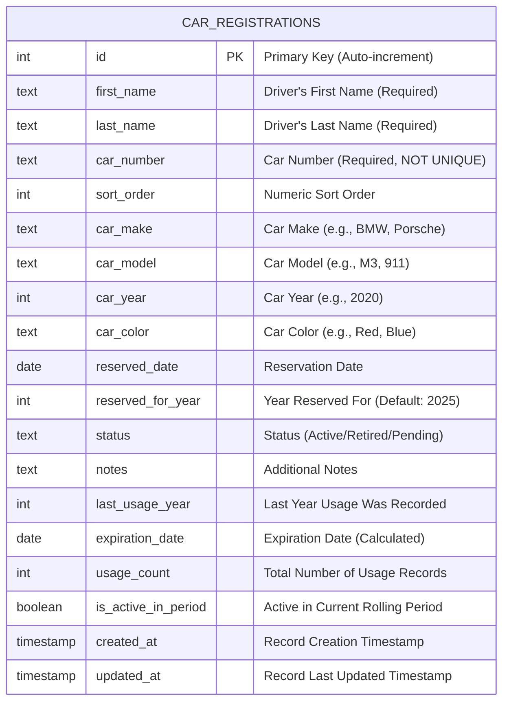
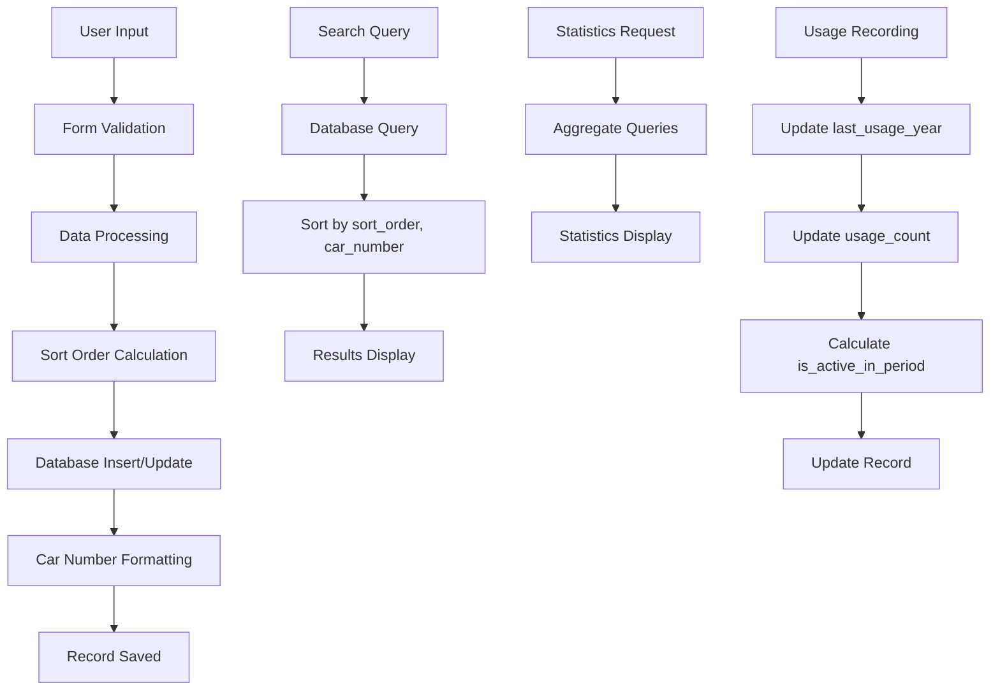

# 🗄️ Nord Stern Car Numbers - Database ER Diagram

## Database Schema Overview

The Nord Stern Car Numbers application uses a **SQLite database** with a single main table that stores all car registration information.

---

## 📊 Entity-Relationship Diagram



---

## 📋 Table Structure Details

### **Table Name**: `car_registrations`

| Column | Data Type | Constraints | Description |
|--------|-----------|-------------|-------------|
| `id` | INTEGER | PRIMARY KEY, AUTOINCREMENT | Unique identifier for each registration |
| `first_name` | TEXT | NOT NULL | Driver's first name |
| `last_name` | TEXT | NOT NULL | Driver's last name |
| `car_number` | TEXT | NOT NULL | Car number (preserves original format) |
| `sort_order` | INTEGER | NULL | Numeric value for sorting (converted from car_number) |
| `car_make` | TEXT | NULL | Manufacturer (e.g., BMW, Porsche, Audi) |
| `car_model` | TEXT | NULL | Model name (e.g., M3, 911, RS4) |
| `car_year` | INTEGER | NULL | Manufacturing year |
| `car_color` | TEXT | NULL | Vehicle color |
| `reserved_date` | DATE | NULL | Date when number was reserved |
| `reserved_for_year` | INTEGER | DEFAULT 2025 | Year the reservation is for |
| `status` | TEXT | DEFAULT 'Active' | Registration status |
| `notes` | TEXT | NULL | Additional information |
| `last_usage_year` | INTEGER | NULL | Last year usage was recorded |
| `expiration_date` | DATE | NULL | Calculated expiration date based on usage |
| `usage_count` | INTEGER | DEFAULT 0 | Total number of usage records |
| `is_active_in_period` | BOOLEAN | DEFAULT 1 | Active in current 3-year rolling period |
| `created_at` | TIMESTAMP | DEFAULT CURRENT_TIMESTAMP | Record creation time |
| `updated_at` | TIMESTAMP | DEFAULT CURRENT_TIMESTAMP | Last update time |

---

## 🔑 Key Relationships

### **Primary Key**
- `id` - Auto-incrementing unique identifier

### **Unique Constraints**
- `id` - Primary key constraint only
- `car_number` - **NO LONGER UNIQUE** (allows duplicate car numbers)

### **Database Indexes**
- `idx_car_number` - Index on `car_number` for fast lookups
- `idx_sort_order` - Index on `sort_order` for efficient sorting
- `idx_name` - Composite index on `first_name, last_name` for name searches
- `idx_status` - Index on `status` for status-based queries

### **Required Fields**
- `first_name` - Must be provided
- `last_name` - Must be provided  
- `car_number` - Must be provided (but not unique)
- `sort_order` - Calculated from car_number (can be NULL for invalid numbers)

---

## 📈 Data Flow



---

## 🎯 Business Rules

### **Car Number Management**
- Car numbers are stored as TEXT preserving original format (e.g., "1", "14", "001", "014")
- Car numbers are **NOT UNIQUE** - duplicates are allowed
- `sort_order` field provides numeric sorting (e.g., "1" and "001" both have sort_order = 1)
- Numbers are sorted by `sort_order` first, then by `car_number` for consistent display

### **Usage Tracking**
- `last_usage_year` tracks the most recent year usage was recorded
- `expiration_date` stores the calculated expiration date based on usage and reservation
- `usage_count` tracks total number of usage records
- `is_active_in_period` indicates if registration is active in current 3-year rolling period

### **Status Management**
- **Active**: Currently registered and participating
- **Retired**: No longer active but record preserved
- **Pending**: Registration in progress

### **Data Integrity**
- Automatic timestamps for creation and updates
- Required fields enforced at database level
- `sort_order` calculated automatically from `car_number`

---

## 🔍 Query Examples

### **Search by Driver Name (with proper sorting)**
```sql
SELECT * FROM car_registrations 
WHERE first_name LIKE '%John%' OR last_name LIKE '%Doe%'
ORDER BY sort_order, car_number;
```

### **Search by Car Number**
```sql
SELECT * FROM car_registrations 
WHERE car_number = '001'
ORDER BY sort_order, car_number;
```

### **Statistics Query**
```sql
SELECT 
    COUNT(*) as total,
    COUNT(CASE WHEN status = 'Active' THEN 1 END) as active,
    COUNT(CASE WHEN status = 'Retired' THEN 1 END) as retired,
    MAX(sort_order) as max_number,
    COUNT(CASE WHEN is_active_in_period = 1 THEN 1 END) as active_in_period
FROM car_registrations;
```

### **Most Common Car Makes**
```sql
SELECT car_make, COUNT(*) as count 
FROM car_registrations 
WHERE car_make IS NOT NULL AND car_make != '' 
GROUP BY car_make 
ORDER BY count DESC;
```

### **Usage Statistics**
```sql
SELECT 
    COUNT(CASE WHEN usage_count > 0 THEN 1 END) as registrations_with_usage,
    AVG(usage_count) as avg_usage_count,
    MAX(usage_count) as max_usage_count
FROM car_registrations;
```

---

## 🛠️ Database Operations

### **Create Registration**
```sql
INSERT INTO car_registrations 
(first_name, last_name, car_number, sort_order, car_make, car_model, car_year, car_color, reserved_date, notes)
VALUES (?, ?, ?, ?, ?, ?, ?, ?, ?, ?);
```

### **Update Registration**
```sql
UPDATE car_registrations 
SET first_name=?, last_name=?, car_number=?, sort_order=?, car_make=?, car_model=?, 
    car_year=?, car_color=?, reserved_date=?, status=?, notes=?, 
    updated_at=CURRENT_TIMESTAMP
WHERE id=?;
```

### **Record Usage**
```sql
UPDATE car_registrations 
SET last_usage_year=?, usage_count=usage_count+1, 
    expiration_date=?, is_active_in_period=1, updated_at=CURRENT_TIMESTAMP
WHERE id=?;
```

### **Remove Usage**
```sql
UPDATE car_registrations 
SET usage_count=GREATEST(0, usage_count-1), 
    updated_at=CURRENT_TIMESTAMP
WHERE id=?;
```

### **Delete Registration**
```sql
DELETE FROM car_registrations WHERE id = ?;
```

---

## 📊 Sample Data Structure

| id | first_name | last_name | car_number | sort_order | car_make | car_model | car_year | car_color | status | last_usage_year | expiration_date | usage_count | is_active_in_period | created_at |
|----|------------|-----------|------------|------------|----------|-----------|----------|-----------|--------|-----------------|-----------------|-------------|-------------------|------------|
| 1 | John | Doe | 001 | 1 | BMW | M3 | 2020 | Black | Active | 2024 | 2027-01-01 | 3 | 1 | 2025-01-15 10:30:00 |
| 2 | Jane | Smith | 1 | 1 | Porsche | 911 | 2021 | Red | Active | 2023 | 2026-01-01 | 2 | 0 | 2025-01-15 11:15:00 |
| 3 | Bob | Johnson | 014 | 14 | Audi | RS4 | 2019 | Silver | Retired | 2022 | 2025-01-01 | 1 | 0 | 2025-01-15 12:00:00 |

---

## 🔧 Database File Information

- **File**: `car_numbers.db`
- **Type**: SQLite 3.x
- **Location**: Application root directory
- **Backup**: Recommended before major operations

---

## 🔄 Schema Migration Notes

### **Key Changes from Previous Version:**
1. **Removed UNIQUE constraint** from `car_number` column
2. **Added `sort_order` column** for proper numeric sorting
3. **Added usage tracking columns**: `last_usage_year`, `usage_count`, `is_active_in_period`
4. **Added `expiration_date` column** for calculated expiration dates
5. **Updated sorting logic** to use `sort_order` for consistent display
6. **Added database indexes** for improved query performance

### **Migration Script:**
The `migrate_sort_order.py` script handles adding the `sort_order` column and populating it with numeric values derived from `car_number`.

---

*This ER diagram represents the complete database schema for the Nord Stern Car Numbers Drivers Education Management System.* 