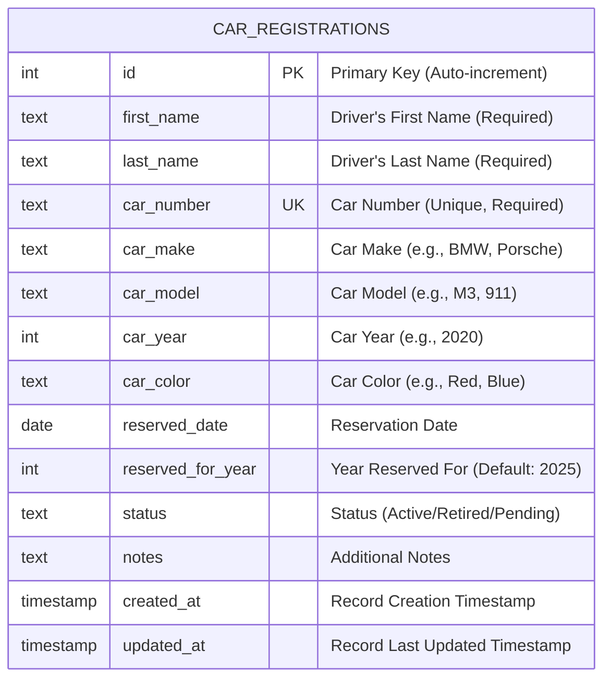
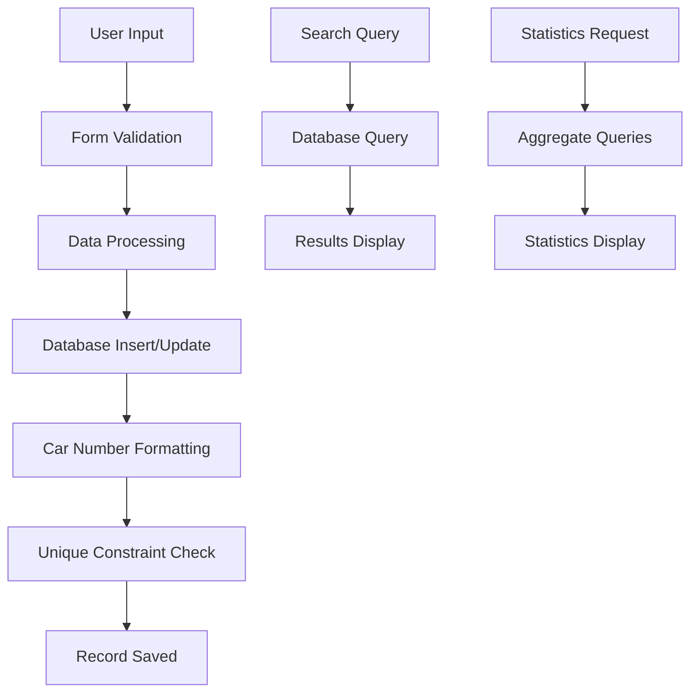

# 🗄️ NordStern Car Numbers - Database ER Diagram

## Database Schema Overview

The NordStern Car Numbers application uses a **SQLite database** with a single main table that stores all car registration information.

---

## 📊 Entity-Relationship Diagram



---

## 📋 Table Structure Details

### **Table Name**: `car_registrations`

| Column | Data Type | Constraints | Description |
|--------|-----------|-------------|-------------|
| `id` | INTEGER | PRIMARY KEY, AUTOINCREMENT | Unique identifier for each registration |
| `first_name` | TEXT | NOT NULL | Driver's first name |
| `last_name` | TEXT | NOT NULL | Driver's last name |
| `car_number` | TEXT | UNIQUE, NOT NULL | Car number (formatted with leading zeros) |
| `car_make` | TEXT | NULL | Manufacturer (e.g., BMW, Porsche, Audi) |
| `car_model` | TEXT | NULL | Model name (e.g., M3, 911, RS4) |
| `car_year` | INTEGER | NULL | Manufacturing year |
| `car_color` | TEXT | NULL | Vehicle color |
| `reserved_date` | DATE | NULL | Date when number was reserved |
| `reserved_for_year` | INTEGER | DEFAULT 2025 | Year the reservation is for |
| `status` | TEXT | DEFAULT 'Active' | Registration status |
| `notes` | TEXT | NULL | Additional information |
| `created_at` | TIMESTAMP | DEFAULT CURRENT_TIMESTAMP | Record creation time |
| `updated_at` | TIMESTAMP | DEFAULT CURRENT_TIMESTAMP | Last update time |

---

## 🔑 Key Relationships

### **Primary Key**
- `id` - Auto-incrementing unique identifier

### **Unique Constraints**
- `car_number` - Ensures no duplicate car numbers

### **Required Fields**
- `first_name` - Must be provided
- `last_name` - Must be provided  
- `car_number` - Must be provided and unique

---

## 📈 Data Flow



---

## 🎯 Business Rules

### **Car Number Management**
- Car numbers are stored as TEXT with leading zeros (e.g., "001", "014", "123")
- Each car number must be unique across all registrations
- Numbers are automatically formatted to 3 digits with leading zeros

### **Status Management**
- **Active**: Currently registered and participating
- **Retired**: No longer active but record preserved
- **Pending**: Registration in progress

### **Data Integrity**
- Automatic timestamps for creation and updates
- Required fields enforced at database level
- Unique constraints prevent duplicate car numbers

---

## 🔍 Query Examples

### **Search by Driver Name**
```sql
SELECT * FROM car_registrations 
WHERE first_name LIKE '%John%' OR last_name LIKE '%Doe%'
ORDER BY car_number;
```

### **Search by Car Number**
```sql
SELECT * FROM car_registrations 
WHERE car_number = '001';
```

### **Statistics Query**
```sql
SELECT 
    COUNT(*) as total,
    COUNT(CASE WHEN status = 'Active' THEN 1 END) as active,
    COUNT(CASE WHEN status = 'Retired' THEN 1 END) as retired,
    MAX(CAST(car_number AS INTEGER)) as max_number
FROM car_registrations;
```

### **Most Common Car Makes**
```sql
SELECT car_make, COUNT(*) as count 
FROM car_registrations 
WHERE car_make IS NOT NULL AND car_make != '' 
GROUP BY car_make 
ORDER BY count DESC;
```

---

## 🛠️ Database Operations

### **Create Registration**
```sql
INSERT INTO car_registrations 
(first_name, last_name, car_number, car_make, car_model, car_year, car_color, reserved_date, notes)
VALUES (?, ?, ?, ?, ?, ?, ?, ?, ?);
```

### **Update Registration**
```sql
UPDATE car_registrations 
SET first_name=?, last_name=?, car_number=?, car_make=?, car_model=?, 
    car_year=?, car_color=?, reserved_date=?, status=?, notes=?, 
    updated_at=CURRENT_TIMESTAMP
WHERE id=?;
```

### **Delete Registration**
```sql
DELETE FROM car_registrations WHERE id = ?;
```

---

## 📊 Sample Data Structure

| id | first_name | last_name | car_number | car_make | car_model | car_year | car_color | status | created_at |
|----|------------|-----------|------------|----------|-----------|----------|-----------|--------|------------|
| 1 | John | Doe | 001 | BMW | M3 | 2020 | Black | Active | 2025-01-15 10:30:00 |
| 2 | Jane | Smith | 002 | Porsche | 911 | 2021 | Red | Active | 2025-01-15 11:15:00 |
| 3 | Bob | Johnson | 014 | Audi | RS4 | 2019 | Silver | Retired | 2025-01-15 12:00:00 |

---

## 🔧 Database File Information

- **File**: `car_numbers.db`
- **Type**: SQLite 3.x
- **Location**: Application root directory
- **Backup**: Recommended before major operations

---

*This ER diagram represents the complete database schema for the NordStern Car Numbers Drivers Education Management System.* 